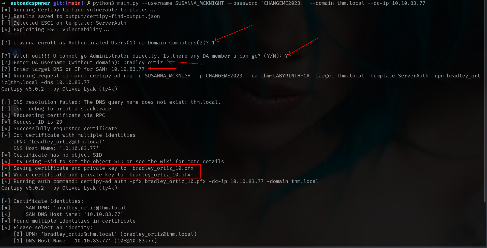
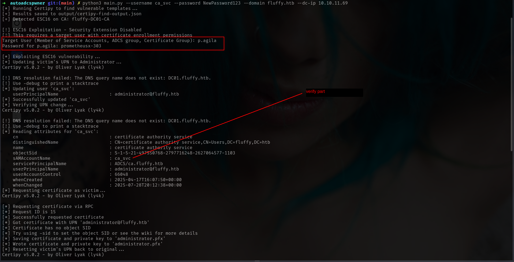
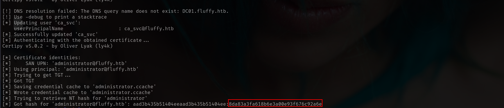

# autoadcspwner
Automatic ADCS pwner

## Proof  
### ESC1  

### ESC1 when Enrollement on Domain Computers

### ESC1 when Enrollement on Authenticated Users

### ESC4  

### ESC7  

### ESC9

### ESC16
Request Part

Update part

